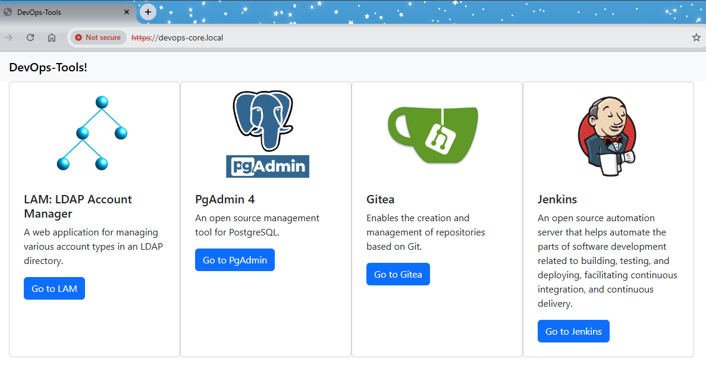

This project is a prototype that helps you setup your private/on-premise devops environment.

The goal is to make it a complete set of tools contaning at least:
- ***dns server***:  allow you to access your applications through an user friendly URI instead of the use of ip and port. This approach also helps you to escalate your server moving it to another location in a almost transparent way.
- ***vpn connection***: allow you to acess your private environment from anywhere with encripted connection.
- ***open LDAP repository***: allows you access different applications with the same login and password. It also make easy to add your friends and give them access to your applications.
- ***git server***: allow you to create your own projects and repositories to start your own CI/CD pipeline. 
- ***jenkins server***: an open source automation server which enables developers around the world to reliably build, test, and deploy their software.

# Quick Start Guide

Install the following software to run everything in a single local virtual machine:
- Virtualbox: https://www.virtualbox.org/wiki/Downloads
- Vagrant: https://developer.hashicorp.com/vagrant/install?product_intent=vagrant
  
Go to `vagrant` folder and execute `run.bat`.

If everything goes well, you should be able to connect via wireguard VPN and access the home page by typig https://devops-core.local/



## Custom configuration

To install in a different machine, add your user name and server address in ansible inventory hosts file:
```
./ansible/inventory/hosts.yml
```

Run then following command to generate SSL/VPN keys and execure the project:
```
ansible-playbook ./ansible/devops-tools.yml -i ./ansible/inventory
```

# Going deeper in the devops-tools project

This project uses ansible to install all requrired software and configuration in the remote host.

## Basic tools

To run ansible playbooks, you first need a server with SSH connection. 
This project was been tested so far using DEBIAN 12, and it is the recommended operating system.

You also need some local storage for personalised configuration such as keys and certificates. By default this will be stored in the `data` folder that will be created in the project root folder. This folder is in `.gitignore` file.

You can define a different location by setting `core__config_path` variable.

## UFW (Firewall)

This project uses ufw as a firewall. After being installed it will block all incoming requests, except by the port and address used by ansible to access the remote machine.

## Bind9 (DNS)

Bind9 is a free DNS server.
You can set your own domain in the variable `core_base_domain`. Default is `devops-tools.local`.

## Wireguard (VPN)

To setup up your own vpn, set the following variables if you want some customization:
- ***core__network_prefix***: is the vpn address space. It has only the first 3 bytes and by default is `172.16.20`. This will be the base for clients and server addresses.
- ***wg__network_name***: this is the interface name in the server and the file name for clients. Default is `wg_vpn`.
- ***wg__server_port***: this is the port where the clients will connect.  Default is `51820`.

It will also setup the DNS server pointing to your own DNS server. So, you can used personal URL's when connected through VPN.

You can change to other servers by changing the value in `wg__client_dns`.

### Generating VPN keys

The role `wireguard/config` will generate all keys for clients and server. The keys are locally stored in the variable `wg__data_path`. Default is `/data/wireguard`.

This role has a list of `key/pairs` containing respectively a name to identify the client and one `id`. The `id` will be used as a suffix to compose the client address.

### Installing the VPN

The role `wireguard\server` will install the application using the parameters generated by the config role. It will also set up the proper config in ufw.

### Postgres database

The system will add a Postgres container and PG admin.
PG Admin is an Open Source data base administration for Postgres.

### Adding LDAP users and groups

The system uses Open LDAP to authenticate users and it includes a LAM container.
LAM stands for "LDAP Account Manager" and it allows you to manage your LDAP server, by adding users and groups.

### GITEA

Gitea is a lightweight git manager repository.
It will be by default connected to the Open LDAP server.
You can access it using the `gitea__admin_user` or the `ldap__default_username`.
To add more users as administrators you need to add the user in the group `admin` using the `tree view` in the `tools` menu.
This admin group is an object of type `groupOfNames` and it doesn't have support in the LAM free version, so you can only add users in this group through the tree view editor.

### Jenkins

Jenkins will be installed with Jenkins configurations as code plugin and two nodes.
It will be already connected to LDAP server, so you can login with your LDAP username and password.
The default values are:
username: devops
password: password
